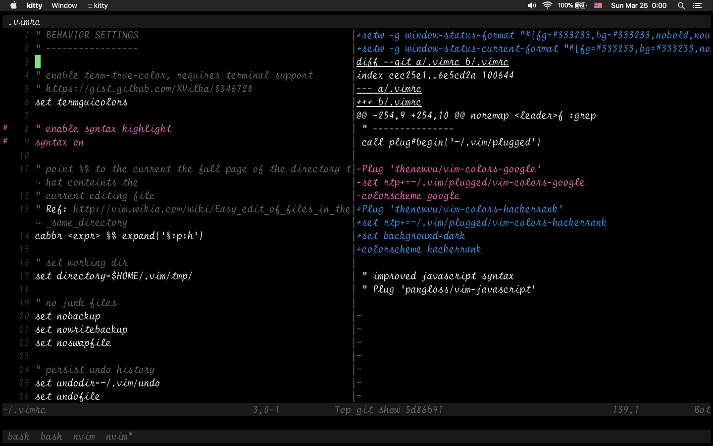

## What is this?

A color scheme was inspired by [a video from HackerRank's youtube channel](https://www.youtube.com/watch?v=shs0KM3wKv8).



## Color scheme

```
# special
foreground    #F1EFF1
cursor        #7BE281
background    #010001

# black
color0        #010001
color8        #010001

# red
color1        #E365AA
color9        #E365AA

# green
color2        #7BE281
color10       #7BE281

# yellow
color3        #F8D561
color11       #F8D561

# blue
color4        #3C8EDF
color12       #3C8EDF

# magenta
color5        #E365AA
color13       #E365AA

# cyan
color6        #3C8EDF
color14       #3C8EDF

# white
color7        #F1EFF1
color15       #F1EFF1
```

## License

MIT
